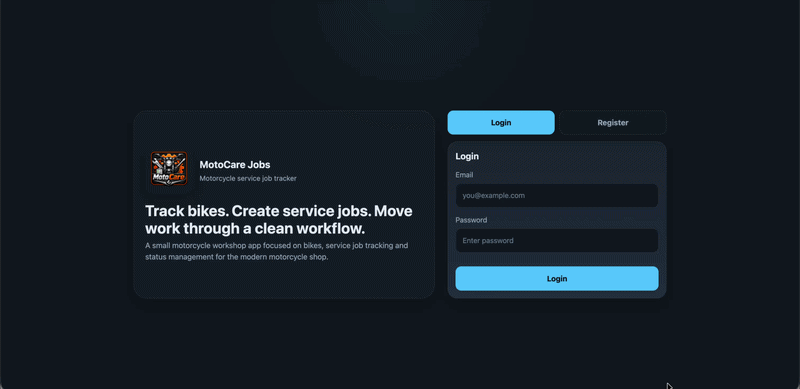
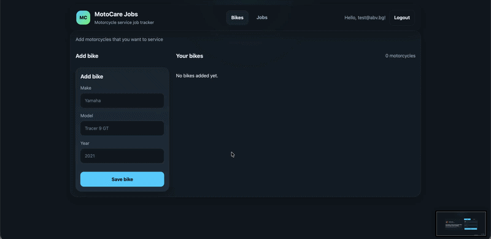
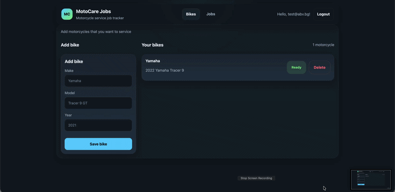
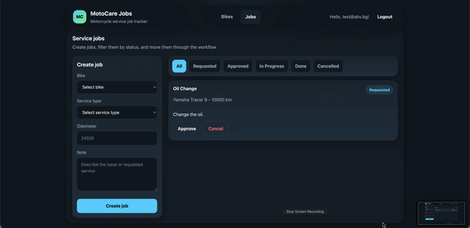

# MotoCare Service Tracker

MotoCare Service Tracker is a full-stack motorcycle service workflow app built as a QA Automation portfolio project. It focuses on service-job lifecycle management, backend-driven state transitions, filtering, persistence, and end-to-end reliability.

**Live app:** https://motocare-service-tracker.onrender.com/

---

## What this project demonstrates

- building and testing a stateful full-stack workflow app
- frontend and backend validation working together
- backend-driven job status transitions
- Playwright E2E coverage across real user flows
- Playwright API coverage for backend contracts and validation
- CI execution through GitHub Actions
- testability-focused design: stable data-testid selectors, reusable Page Objects, isolated test data, and Dockerized local runs
- real deployment with **Render + Neon**

---

## Features

### Authentication

- User registration
- User login
- Logout
- Auth persistence across refresh
- Per-user data isolation




### Bikes

- Add bikes
- Delete bikes
- Bike list persistence across refresh
- Empty state handling
- Per-user bike isolation
- Derived bike readiness state:
  - **Ready** if no open jobs exist
  - **Not ready** if at least one related open job exists

  

### Service jobs

- Create service jobs for a selected bike
- View jobs list
- Persist jobs across refresh
- Per-user job isolation
- Per-bike job association



### Job statuses

MotoCare Jobs supports these statuses:

- "requested"
- "approved"
- "in_progress"
- "done"
- "cancelled"



Allowed transitions:

- "requested > approved"
- "requested > cancelled"
- "approved > in_progress"
- "approved > cancelled"
- "in_progress > done"

Invalid transitions are rejected by the backend and covered by automated tests.

### Filtering

Jobs can be filtered by status:

- All
- Requested
- Approved
- In Progress
- Done
- Cancelled

### Integrity behavior

- Deleting a bike removes its related jobs
- Bike readiness updates based on job state
- Job status changes affect bike readiness correctly

---

## Tech stack

- **Frontend:** Vite + Vanilla TypeScript
- **Backend:** Node.js + Express + TypeScript
- **Database:** PostgreSQL (Neon)
- **Containerization:** Docker + Docker Compose
- **Testing:** Playwright
- **CI:** GitHub Actions
- **Deployment:** Render + Neon

---

## Project structure

```text
/web    -> frontend client (Vite + TypeScript)
/api    -> backend REST API (Node + Express + TypeScript)
/tests  -> Playwright API + UI tests
/docs   -> screenshots / assets
Neon    -> PostgreSQL persistence layer
Render  -> frontend + backend hosting
```

## Test coverage

The Playwright suite currently covers:

### Auth

- registration happy path
- duplicate registration
- invalid credential handling
- login happy path
- invalid login cases

### Bikes

- create bike
- delete bike
- validation rules
- user isolation

### Jobs

- create job
- validation rules
- persistence after reload
- filter behavior
- allowed status transitions
- bike isolation
- user isolation

## API coverage

The project includes both Playwright E2E tests and Playwright API tests.

### Auth API

- register success
- duplicate email rejection
- validation checks
- login success
- invalid login rejection

### Bikes API

- create bike success
- validation errors
- delete bike success
- integrity checks

### Jobs API

- create job success
- status transition rules
- filtering-related behavior
- integrity rules

## How tests are run

Playwright is initialized at the repo root because tests target the whole system, not just the frontend.

### Root test harness

```bash
npm install
npm run test:e2e
```

### Other available commands

```bash
npm run test:e2e:ui
npm run test:e2e:headed
npm run test:e2e:debug
```

### Run against Dockerized app

```bash
npm run docker:test:up
npm run test:docker
npm run docker:test:down
```

### Running locally

You need to run both the backend and the frontend.

Before starting locally, configure the API environment:

```text
DATABASE_URL=your_dev_database_url
TEST_DATABASE_URL=your_test_database_url
```

### Terminal 1 — API

```bash
cd api
npm install
npm run dev
```

### Terminal 2 — Web

```bash
cd web
npm install
npm run dev
```

Then open the frontend URL shown in the terminal.

## Run with Docker

```bash
docker compose up --build
```

Stop containers with:

```bash
docker compose down
```

## Deployment

**Frontend**: Render Static Site
**Backend**: Render Web Service
**Database**: Neon PostgreSQL

## CI

GitHub Actions runs the Playwright suite on push and pull request.

## Notes

Hosted on free-tier infrastructure, so the first request may be slower due to cold starts.
